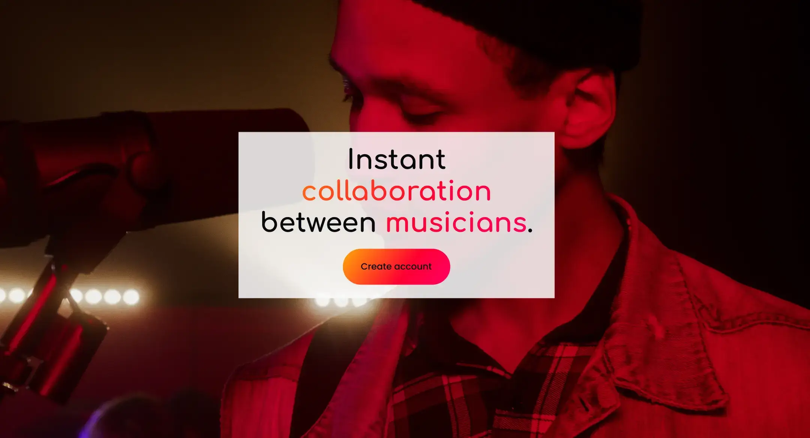
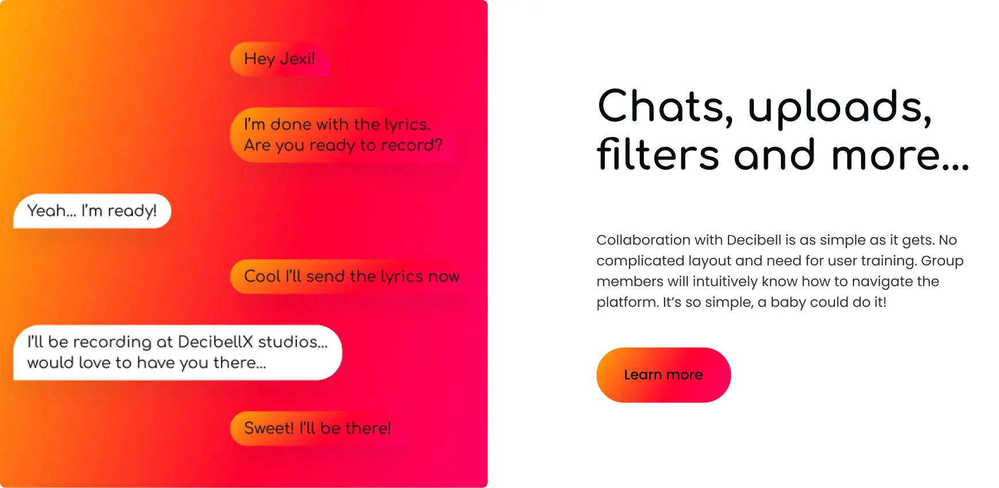
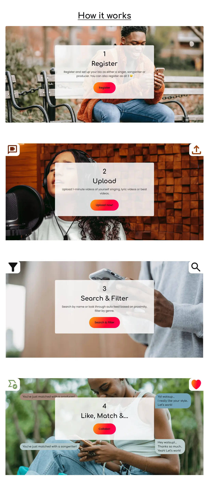
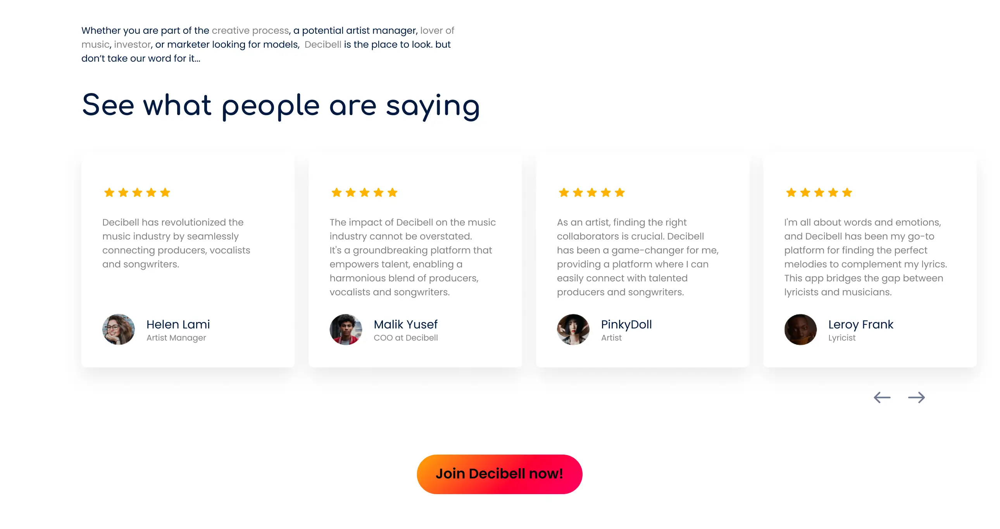
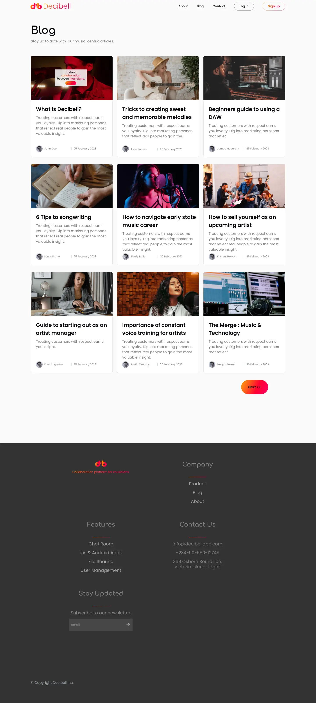
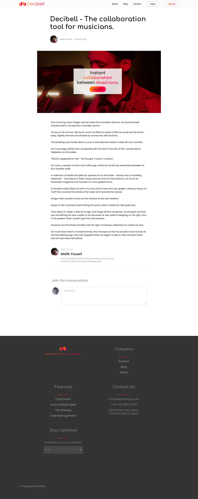

# 
Decibell

 
 

Instant collaboration between musicians.

## Site

Visit decibell's landing page [here](https://decibell.vercel.app)

## Case Study

Learn more about Decibell - [case study](https://pixelayo.vercel.app/ayo/case-study/decibell).

## The Concept

Decibell represents a vibrant and dynamic social platform, tailored explicitly to serve the interconnected needs of musicians within the industry. This innovative space serves as a hub where a mix of producers, vocalists and songwriters converge to not only forge connections but also indulge in the art of collaborative creation. Beyond mere networking, Decibell fosters an
environment ripe with opportunities, encouraging creative minds to unite, exchange ideas, and craft musical masterpieces together.

## Landing Page

The primary objective of this project was to develop a compelling landing page for Decibell, aimed at fostering widespread awareness regarding its concept. 
Furthermore, the intention is to attract potential investors or individuals willing to undertake full stewardship of the project, thereby propelling its realization to fruition.

## Screenshots

 

 

 

 

## Built with

- [Next.js](https://nextjs.org/) - Nextjs provides built-in components such as [next/image](https://nextjs.org/docs/pages/api-reference/components/image) that automatically optimize elements. It also enables server-side rendering([SSR](https://nextjs.org/docs/pages/building-your-application/rendering/server-side-rendering)) which is good for search engine optimization([SEO](https://nextjs.org/learn-pages-router/seo/introduction-to-seo)) and lead to faster loading times for static webpages.

- [TailwindCSS](https://tailwindcss.com/) - TailwindCSS has an extensive list of utility classes for rapidly building modern websites. It enables flexible customization of classes according to project requirement.

## Contact

If you'll like to take on the full project, talk about another project or just want to say hi,  contact me here:

- [@Ayo](https://pixelayo.vercel.app/ayo/contact)
- Linkedin - [@Ayo](www.linkedin.com/in/ayomide-iyela-b173802b0)
- Check out my portfolio [here](https://pixelayo.vercel.app)
